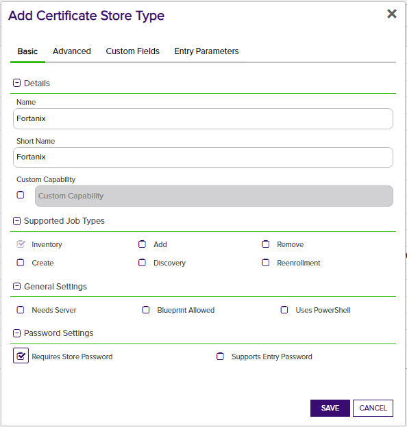
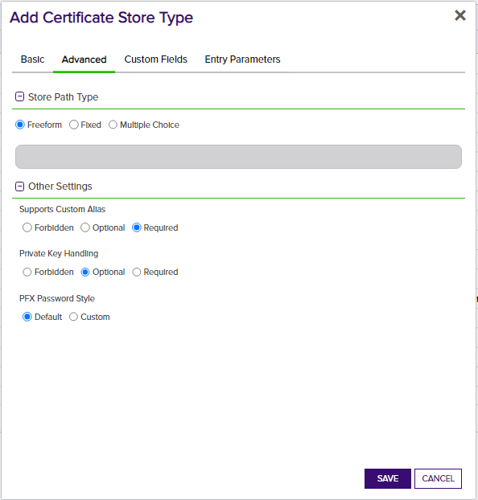
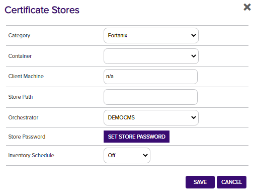

# Fortanix
## orchestrator

The Fortanix orchestrator extension allows for the inventory of certificates in Fortanix stores. Only Inventory is supported. The orchestrator extension the [Fortanix API library](https://www.fortanix.com/api/dsm/) to perform this function..

<!-- add integration specific information below -->

## Use Cases

The Fortanix orchestrator extension implements the following capabilities:
1. Inventory - Return all certificates for a certificate store.

## Versioning

The version number of a the Fortanix orchestrator extension can be verified by right clicking on the Fortanix.dll file, selecting Properties, and then clicking on the Details tab.

## Keyfactor Version Supported

This orchestrator extension has been tested using Keyfactor Command 9.4 the Keyfactor Universal Orchestrator version 9.5.  However this should be compatible with any Keyfactor versions 9.x and above. 

## Fortanix Orchestrator Installation

1. In the Keyfactor Orchestrator installation folder (by convention usually C:\Program Files\Keyfactor\Keyfactor Orchestrator), find the "extensions" folder. Underneath that, create a new folder named "Fortanix".  You may choose to use a different name, but then you must edit the manifest.json file downloaded from GitHub and modify based on step 4 below.
2. Download the latest version of the Fortanix orchestrator extension from [GitHub](https://github.com/Keyfactor/fortanix-orchestrator).
3. Copy the contents of the download installation zip file to folder created in step 1.
4. (Optional) If you decided to name the Fortanix folder in step 1 to something different than the suggested names, you will need to edit the manifest.json file.  Modify "CertStores.{folder name}.*Capability*" to the folder name you used for each store type.

## Fortanix Orchestrator Extension Configuration

**1. In Keyfactor Command, Create a new certificate store type by navigating to Settings (the "gear" icon in the top right) => Certificate Store Types.**

- **Name** – Required. The display name of the new Certificate Store Type
- **Short Name** – Required. Should match the folder name created under the "Extensions" folder.  By default - "Fortanix".
- **Custom Capability** - Unchecked.
- **Supported Job Types** - Inventory only. 
- **General Settings, Password Settings, Store Path Types, and Other Settings** – All checked/unchecked as shown
- Custom Fields and Entry Parameters tabs need not be modified.

**2. Create a Fortanix certificate store within Keyfactor Command**

Navigate to Certificate Locations => Certificate Stores within Keyfactor Command to add the store. Below are the values that should be entered.

- **Category** – Required. The Fortanix type name (or alternate named based on certificate store type setup) must be selected.
- **Container** – Optional. Select a container if utilized.
- **Client Machine** – Required. A place holder value is required to be entered here, but the value does not matter.  "n/a" or other place holder value would be fine.
- **Orchestrator** - Required. Select the orchestrator assigned to handle Fortanix jobs.
- **Store Password** - Required. Paste in the Fortanix API Key here or if you have a PAM provider integration set up, select "Load From PAM Provider, and paste the PAM Provider key here, pointing to the Fortanix API key.
- **Inventory Schedule** - Optional. Select a schedule to run inventory jobs for this certificate store.
